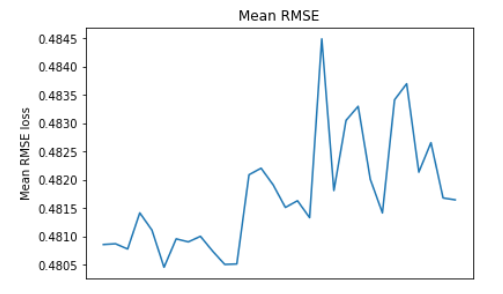

```python
# Dataset used
d = pd.read_csv('HIGGS.csv', header=None, nrows=11000000*0.002)
```

(Run code from the notebook)
...
...
.

## 1. Depth and child weight analysis

```python
# Update parameters
mean_rmses = []
gridsearch_params = [
    (max_depth, min_child_weight)
    for max_depth in range(5, 20, 3)
    for min_child_weight in range(3, 15, 2)
]

for max_depth, min_child_weight in gridsearch_params:
  params['max_depth'] = max_depth
  params['min_child_weight'] = min_child_weight

  # Run cross validation
  cv_results = xgb.cv(
      params,
      train,
      num_boost_round=200,
      seed=42,
      nfold=5,
      metrics={'rmse'},
      early_stopping_rounds=10
  )

  # Update best mean RMSE
  mean_rmse = cv_results['test-rmse-mean'].min()
  mean_rmses.append(mean_rmse)
  print(f"Mean RMSE: {mean_rmse}, max_depth: {max_depth}, min_child_weight: {min_child_weight}")

  
  ## Output:
  """
  Mean RMSE: 0.48085880000000003, max_depth: 5, min_child_weight: 3
  Mean RMSE: 0.48087179999999996, max_depth: 5, min_child_weight: 5
  Mean RMSE: 0.4807796, max_depth: 5, min_child_weight: 7
  Mean RMSE: 0.4814178, max_depth: 5, min_child_weight: 9
  Mean RMSE: 0.481114, max_depth: 5, min_child_weight: 11
  Mean RMSE: 0.4804576, max_depth: 5, min_child_weight: 13
  Mean RMSE: 0.48095920000000003, max_depth: 8, min_child_weight: 3
  Mean RMSE: 0.4809056, max_depth: 8, min_child_weight: 5
  Mean RMSE: 0.48100339999999997, max_depth: 8, min_child_weight: 7
  Mean RMSE: 0.4807436, max_depth: 8, min_child_weight: 9
  Mean RMSE: 0.4805076, max_depth: 8, min_child_weight: 11
  Mean RMSE: 0.480515, max_depth: 8, min_child_weight: 13
  Mean RMSE: 0.4820906, max_depth: 11, min_child_weight: 3
  Mean RMSE: 0.48220599999999997, max_depth: 11, min_child_weight: 5
  Mean RMSE: 0.48191000000000006, max_depth: 11, min_child_weight: 7
  Mean RMSE: 0.4815134, max_depth: 11, min_child_weight: 9
  Mean RMSE: 0.48163180000000005, max_depth: 11, min_child_weight: 11
  Mean RMSE: 0.48133220000000004, max_depth: 11, min_child_weight: 13
  Mean RMSE: 0.48448919999999995, max_depth: 14, min_child_weight: 3
  Mean RMSE: 0.4818116, max_depth: 14, min_child_weight: 5
  Mean RMSE: 0.48305, max_depth: 14, min_child_weight: 7
  Mean RMSE: 0.4832986, max_depth: 14, min_child_weight: 9
  Mean RMSE: 0.4820118, max_depth: 14, min_child_weight: 11
  Mean RMSE: 0.4814168, max_depth: 14, min_child_weight: 13
  Mean RMSE: 0.483413, max_depth: 17, min_child_weight: 3
  Mean RMSE: 0.4836978, max_depth: 17, min_child_weight: 5
  Mean RMSE: 0.48213619999999996, max_depth: 17, min_child_weight: 7
  Mean RMSE: 0.48265719999999995, max_depth: 17, min_child_weight: 9
  Mean RMSE: 0.48168059999999996, max_depth: 17, min_child_weight: 11
  Mean RMSE: 0.48164739999999995, max_depth: 17, min_child_weight: 13
  """
```  

Analysis text:
The above initial analysis was done on a smaller dataset (100 times smaller than the dataset that will be used for training ahead): <br>

Increasing max tree depth beyond 11 or 12 doesn't help since the loss increases thereafter. Comparatively higher values for `min_child_weight` gives lower errors.
Best combination for this subset of data: max_depth: 5, min_child_weight: 13

Since the actual dataset is larger, a larger depth would be needed, for example, 10.



## 2. Learning rate analysis

```python
%time

# Learning rate tuning
min_rmse = float("Inf")
best_params = None
for eta in [.3, .2, .1, .05, .01, .005]:
    print(f"CV with eta={eta}")
    # Update our parameters
    params["eta"] = eta
    # Run and time cross validation process
    cv_results = xgb.cv(
            params,
            train,
            num_boost_round=num_boost_round,
            seed=42,
            nfold=5,
            metrics=['rmse'],
            early_stopping_rounds=10
          )
    # Update best score
    mean_rmse = cv_results['test-rmse-mean'].min()
    boost_rounds = cv_results['test-rmse-mean'].argmin()
    print(fr"\tRMSE {mean_rmse} for {boost_rounds} rounds\n")
    if mean_rmse < min_rmse:
        min_rmse = mean_rmse
        best_params = eta
print(f"Best params: {best_params}, MAE: {min_rmse}")

## Output:
"""
CPU times: user 3 µs, sys: 0 ns, total: 3 µs
Wall time: 11.2 µs
CV with eta=0.3
\tRMSE 0.49004820000000004 for 7 rounds\n
CV with eta=0.2
\tRMSE 0.48635459999999997 for 9 rounds\n
CV with eta=0.1
\tRMSE 0.48140979999999994 for 48 rounds\n
CV with eta=0.05
\tRMSE 0.4793374 for 69 rounds\n
CV with eta=0.01
\tRMSE 0.47797979999999995 for 299 rounds\n
CV with eta=0.005
\tRMSE 0.4813002 for 299 rounds\n
Best params: 0.01, MAE: 0.47797979999999995
"""

```
Analysis text:
A `lr` of the order of `1e-2` yields sligthly lower errors. We will use the learning rate that yields the lowest error, and not worry about the time taken.

## 3. Subsample and colsample_bytree analysis

```python
gridsearch_params = [
    (subsample, colsample)
    for subsample in [i/10. for i in range(7,11)]
    for colsample in [i/10. for i in range(7,11)]
]

min_rmse = float("Inf")
best_params = None
# Start by the largest values and go down to the smallest
for subsample, colsample in reversed(gridsearch_params):
    print(f"CV with subsample={subsample}, colsample={colsample}")
    # We update our parameters
    params['subsample'] = subsample
    params['colsample_bytree'] = colsample
    # Run cross validation
    cv_results = xgb.cv(
        params,
        train,
        num_boost_round=num_boost_round,
        seed=42,
        nfold=5,
        metrics={'rmse'},
        early_stopping_rounds=10
    )
    # Update best score
    mean_rmse = cv_results['test-rmse-mean'].min()
    boost_rounds = cv_results['test-rmse-mean'].argmin()
    print(f"\RMSE {mean_rmse} for {boost_rounds} rounds")
    if mean_rmse < min_rmse:
        min_rmse = mean_rmse
        best_params = (subsample,colsample)
print(f"Best params: {best_params[0]}, {best_params[1]}, MAE: {min_rmse}")

## Output:
"""
CV with subsample=1.0, colsample=1.0
\RMSE 0.48110860000000005 for 24 rounds
CV with subsample=1.0, colsample=0.9
\RMSE 0.48039999999999994 for 33 rounds
CV with subsample=1.0, colsample=0.8
\RMSE 0.4821236 for 37 rounds
CV with subsample=1.0, colsample=0.7
\RMSE 0.48227699999999996 for 57 rounds
CV with subsample=0.9, colsample=1.0
\RMSE 0.4791986 for 38 rounds
CV with subsample=0.9, colsample=0.9
\RMSE 0.4799226 for 26 rounds
CV with subsample=0.9, colsample=0.8
\RMSE 0.47961780000000004 for 36 rounds
CV with subsample=0.9, colsample=0.7
\RMSE 0.48087160000000007 for 27 rounds
CV with subsample=0.8, colsample=1.0
\RMSE 0.4809412 for 27 rounds
CV with subsample=0.8, colsample=0.9
\RMSE 0.4809634 for 35 rounds
CV with subsample=0.8, colsample=0.8
\RMSE 0.4805688000000001 for 39 rounds
CV with subsample=0.8, colsample=0.7
\RMSE 0.481953 for 32 rounds
CV with subsample=0.7, colsample=1.0
\RMSE 0.48082140000000007 for 28 rounds
CV with subsample=0.7, colsample=0.9
\RMSE 0.4812296 for 36 rounds
CV with subsample=0.7, colsample=0.8
\RMSE 0.4816522000000001 for 26 rounds
CV with subsample=0.7, colsample=0.7
\RMSE 0.48266200000000004 for 24 rounds
Best params: 0.9, 1.0, MAE: 0.4791986

"""
```
Analysis text:
Results of this analysis might not be relevant since these parameters have to do with the size of the dataset and that this analysis was carried on a subset of the dataset to be trained. Hence, we don't use the best params for training in the actual model.

**Conclusion**
- Cross validation analysis on a smaller dataset might not be indicative of the whole dataset and hence might not be suitable for hyperparameter tuning.