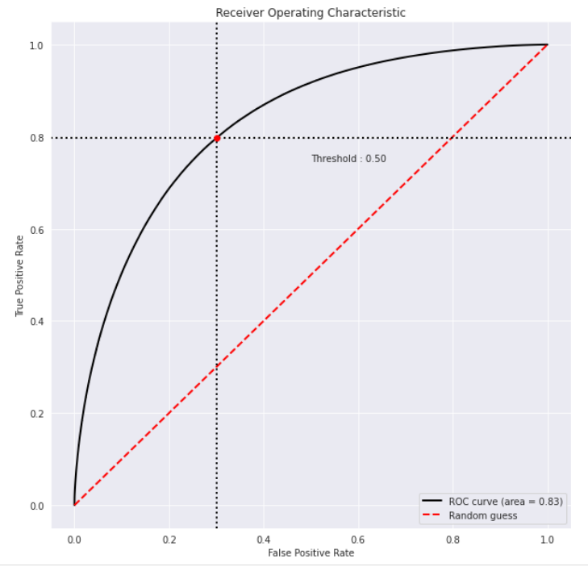
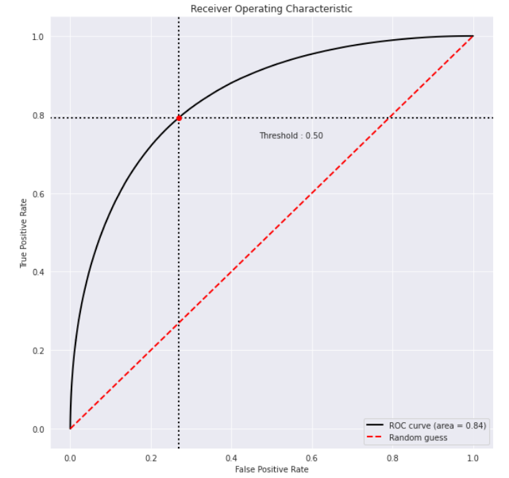
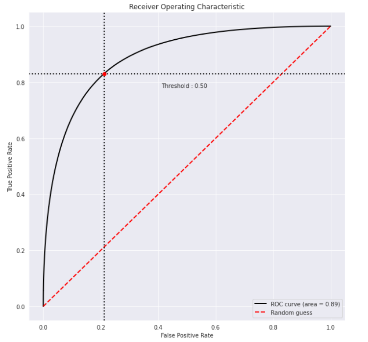

## Further analysis

### This section contains training and testing analysis using different set of parameters.


`new_models/` contains the trained models using the below parameters.

Parameters:
```py
{'colsample_bytree': 0.8,
 'eta': 0.01,
 'eval_metric': 'rmse',
 'max_depth': 18,
 'min_child_weight': 13,
 'objective': 'binary:logistic',
 'subsample': 0.8}
```

 Difference between this and the analysis in `bdt/`: `max_depth` increased to 18. Number of trees increased to 400.

 On low level features (Training time: ~4hrs):
 - AUC = 0.83
 - RMSE = 0.426287

 

 On high level features (Training time: > 1hr 30min)
 - AUC = 0.84
 - RMSE = 0.406682

 

On all features (Training time: slightly > 4 hrs)
- AUC = 0.89
- RMSE = 0.373804


