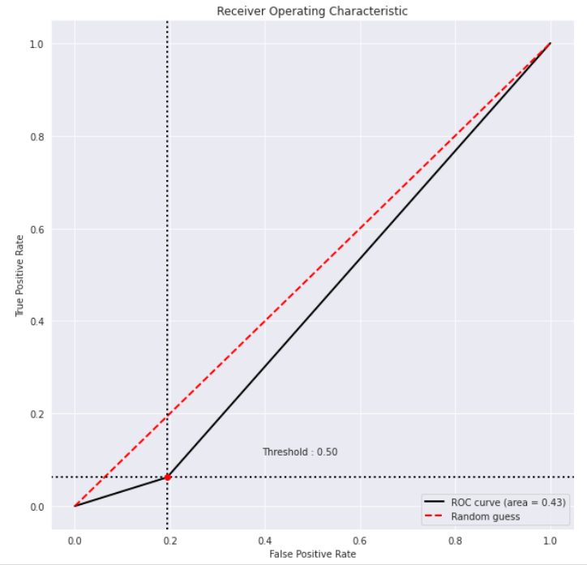

## This section contains first baseline approach which will need to be iterated upon.

Training accuracy: ~61% (after 10 epochs). Time taken: > 3 hours.

AUC score: 0.434

**ROC curve**

- `models/` contains the saved model. `HIGGS_MODEL.pt` is the saved model after training for 10 epochs. It can be loaded and run on the testing set.
